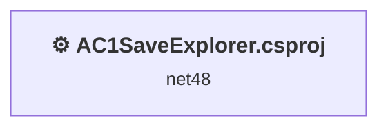
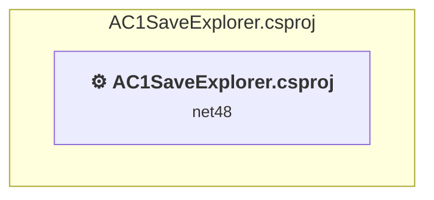

# Projects and dependencies analysis

This document provides a comprehensive overview of the projects and their dependencies in the context of upgrading to .NETCoreApp,Version=v8.0.

## Table of Contents

- [Executive Summary](#executive-Summary)
  - [Highlevel Metrics](#highlevel-metrics)
  - [Projects Compatibility](#projects-compatibility)
  - [Package Compatibility](#package-compatibility)
  - [API Compatibility](#api-compatibility)
  - [Binding Redirect Configuration](#binding-redirect-configuration)
- [Aggregate NuGet packages details](#aggregate-nuget-packages-details)
- [Top API Migration Challenges](#top-api-migration-challenges)
  - [Technologies and Features](#technologies-and-features)
  - [Most Frequent API Issues](#most-frequent-api-issues)
- [Projects Relationship Graph](#projects-relationship-graph)
- [Project Details](#project-details)

  - [AC1SaveExplorer\AC1SaveExplorer.csproj](#ac1saveexplorerac1saveexplorercsproj)

## Executive Summary

### Highlevel Metrics

| Metric | Count | Status |
| :--- | :---: | :--- |
| Total Projects | 1 | All require upgrade |
| Total NuGet Packages | 0 | All compatible |
| Total Code Files | 5 |  |
| Total Code Files with Incidents | 6 |  |
| Total Lines of Code | 186 |  |
| Total Number of Issues | 13 |  |
| Estimated LOC to modify | 11+ | at least 5.9% of codebase |

### Projects Compatibility

| Project | Target Framework | Difficulty | Package Issues | API Issues | Binding Issues | Est. LOC Impact | Description |
| :--- | :---: | :---: | :---: | :---: | :---: | :---: | :--- |
| [AC1SaveExplorer\AC1SaveExplorer.csproj](#ac1saveexplorerac1saveexplorercsproj) | net48 | 🟢 Low | 0 | 11 | 0 | 11+ | ClassicWpf, Sdk Style = False |

### Package Compatibility

| Status | Count | Percentage |
| :--- | :---: | :---: |
| ✅ Compatible | 0 | 0.0% |
| ⚠️ Incompatible | 0 | 0.0% |
| 🔄 Upgrade Recommended | 0 | 0.0% |
| ***Total NuGet Packages*** | ***0*** | ***100%*** |

### API Compatibility

| Category | Count | Impact |
| :--- | :---: | :--- |
| 🔴 Binary Incompatible | 9 | High - Require code changes |
| 🟡 Source Incompatible | 2 | Medium - Needs re-compilation and potential conflicting API error fixing |
| 🔵 Behavioral change | 0 | Low - Behavioral changes that may require testing at runtime |
| ✅ Compatible | 56 |  |
| ***Total APIs Analyzed*** | ***67*** |  |

## Aggregate NuGet packages details

| Package | Current Version | Suggested Version | Projects | Description |
| :--- | :---: | :---: | :--- | :--- |

## Top API Migration Challenges

### Technologies and Features

| Technology | Issues | Percentage | Migration Path |
| :--- | :---: | :---: | :--- |
| Legacy Configuration System | 2 | 18.2% | Legacy XML-based configuration system (app.config/web.config) that has been replaced by a more flexible configuration model in .NET Core. The old system was rigid and XML-based. Migrate to Microsoft.Extensions.Configuration with JSON/environment variables; use System.Configuration.ConfigurationManager NuGet package as interim bridge if needed. |

### Most Frequent API Issues

| API | Count | Percentage | Category |
| :--- | :---: | :---: | :--- |
| T:System.Windows.Application | 2 | 18.2% | Binary Incompatible |
| M:System.Windows.Window.#ctor | 2 | 18.2% | Binary Incompatible |
| M:System.Configuration.ApplicationSettingsBase.#ctor | 1 | 9.1% | Source Incompatible |
| T:System.Configuration.ApplicationSettingsBase | 1 | 9.1% | Source Incompatible |
| M:System.Windows.Application.Run | 1 | 9.1% | Binary Incompatible |
| P:System.Windows.Application.StartupUri | 1 | 9.1% | Binary Incompatible |
| M:System.Windows.Application.#ctor | 1 | 9.1% | Binary Incompatible |
| M:System.Windows.Application.LoadComponent(System.Object,System.Uri) | 1 | 9.1% | Binary Incompatible |
| T:System.Windows.Window | 1 | 9.1% | Binary Incompatible |

## Projects Relationship Graph

Legend:
📦 SDK-style project
⚙️ Classic project

## Project Details

### AC1SaveExplorer\AC1SaveExplorer.csproj

#### Project Info

- **Current Target Framework:** net48
- **Proposed Target Framework:** net8.0-windows
- **SDK-style**: False
- **Project Kind:** ClassicWpf
- **Dependencies**: 0
- **Dependants**: 0
- **Number of Files**: 6
- **Number of Files with Incidents**: 6
- **Lines of Code**: 186
- **Estimated LOC to modify**: 11+ (at least 5.9% of the project)

#### Dependency Graph

Legend:
📦 SDK-style project
⚙️ Classic project

### API Compatibility

| Category | Count | Impact |
| :--- | :---: | :--- |
| 🔴 Binary Incompatible | 9 | High - Require code changes |
| 🟡 Source Incompatible | 2 | Medium - Needs re-compilation and potential conflicting API error fixing |
| 🔵 Behavioral change | 0 | Low - Behavioral changes that may require testing at runtime |
| ✅ Compatible | 56 |  |
| ***Total APIs Analyzed*** | ***67*** |  |

#### Project Technologies and Features

| Technology | Issues | Percentage | Migration Path |
| :--- | :---: | :---: | :--- |
| Legacy Configuration System | 2 | 18.2% | Legacy XML-based configuration system (app.config/web.config) that has been replaced by a more flexible configuration model in .NET Core. The old system was rigid and XML-based. Migrate to Microsoft.Extensions.Configuration with JSON/environment variables; use System.Configuration.ConfigurationManager NuGet package as interim bridge if needed. |

